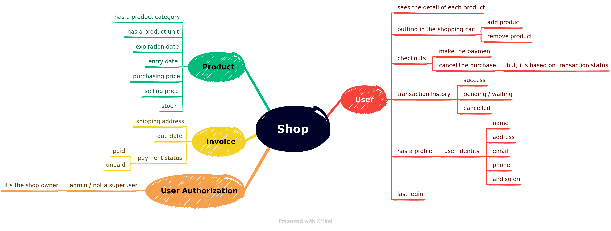

# Simple Shop
This simple shop system is built on top of Python 3.11 using Django framework.

## Requirements
- Python 3.11
- Pipenv

## Run locally for the first time
Do these steps if this is your first time running the project:
1. Create a file named `.env` inside this project root directory.
2. Add a variable `SECRET_KEY=[your_secret_key]`.
3. This project is using [AdminLTE](https://github.com/ColorlibHQ/AdminLTE) as the user interface, so you need to clone it first: `git clone --depth 1 https://github.com/ColorlibHQ/AdminLTE.git templates/`
4. Install all python dependencies: `pipenv install`

## Run locally
1. Use the virtual environment: `pipenv shell`
2. Migrate the database: `python manage.py migrate`
3. Inserting dummy data to the database: `python manage.py loaddata [*.json]`
   
   For example we want to insert dummy data for superuser and all models of catalog app: `python manage.py loaddata users.json catalog.json`

   Available dummy data:
   | File | Function |
   |-|-|
   | `users.json` | initial superuser data |
   | `catalog.json` | initial data for all models within catalog app |
   
4. Make sure you have a superuser to login to django admin page: `python manage.py createsuperuser`, or if you're using dummy data, skip this step.
5. Run the server: `python manage.py runserver 8000`
---
## My abstract idea

